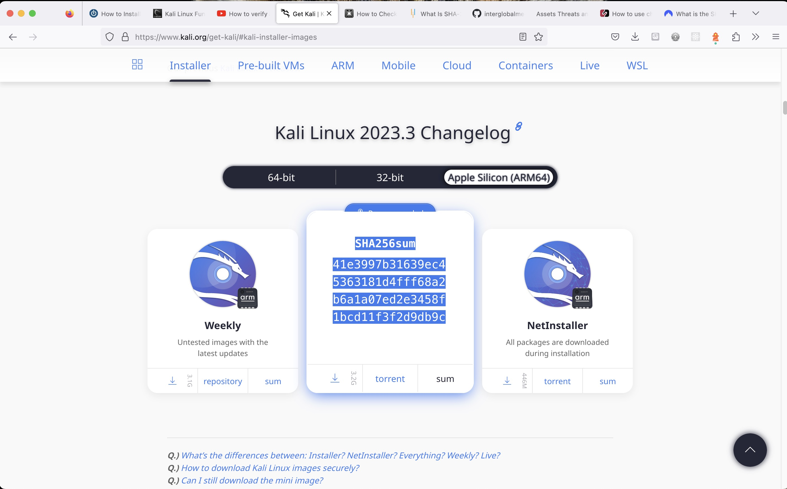

# Check for the integrity of your Kali Linux download (macOS)

After I installed Kali Linux on my Mac, I wanted to make sure that it was not corrupted or changed in any way. In other words, I wanted to check for its integrity. So I used checksum to verify my Kali Linux download.

First of all, I had to locate the `.iso` file of the app (it was in my Downloads folder) to use in my SHA-256 checksum command via command line. No need to use third party online tools. We have everything at our finder tips on our own device. This tool is built into macOS!

The shasum command is available on all modern Macs to check SHA-256 hashes.

## And what is a SHA-256 hash? And a checksum? And why are they important?

When a file is uploaded online available for download by others (like Kali Linux for example), a checksum is provided inside the download so that users who download those files can check the file's integrity for themselves.

Checksums act as a "fingerprints" for files. And a hashing algorithm like SHA-256 using the shasum command on macOS can verify (or reject) the integrity of files by either producing a checksum match or not.

As for SHA2-56, it is part of the SHA (Secure Hashing Algorithms) family of cryptographic hash functions developed by the U.S. National Security Agency (NSA).

Hashing is a process that transforms data into a random fixed-length value, using a hash function. This makes the data very hard to decipher. And SHA-256 specifically refers to the bit size of the hash output. The resulting hash value from SHA-256 is 256 bits long, which provides a significantly larger search space compared to its predecessor, SHA-1, making it computationally infeasible to reverse engineer the original input from the hash value. In other words, it would be "virtually impossible" to crack via brute force attacks.

The robustness of SHA-256 makes it popular in the verification of file integrity. And that is where the `shasum -a 256` command comes in. To check the integrity of my Kali Linux download, I ran the following command in Terminal:

```shell
# file/terminal window location: desktop
shasum -a 256 kali-linux-2023.3-installer-arm64.iso
```

**Note**: The `-a` option is short for `"algorithm"`, and 256 refers to the hash length.

And the following was returned:

```shell
41e3997b31639ec45363181d4fff68a2b6a1a07ed2e3458f1bcd11f3f2d9db9c  kali-linux-2023.3-installer-arm64.iso
```

Next, I had to compare it to the original checksum available on [kalilinux.org](https://www.kali.org/):

```shell
SHA256sum
41e3997b31639ec45363181d4fff68a2b6a1a07ed2e3458f1bcd11f3f2d9db9c
```

The checksums match, so the integrity of my Kali Linux download was intact. This means that the file was not tampered with or corrupted in the download process. If there had been even the slightest change to the file post original checksum creation, the checksums would not have matched.



To access the checksum shown above, there is a "sum" button available to click on located to the bottom right of the download image of any Kali Linux format.

## Breaking down the file verification process of a SHA-256 checksum with the shasum command

**According to Wikipedia**,

>A checksum is a small-sized block of data derived from another block of digital data for the purpose of detecting errors that may have been introduced during its transmission or storage.

To produce a checksum, like say for the original Kali Linux .iso file, we would run a program that puts the file through an algorithm. In the case of the Kali Linux .iso file, it is the SHA-256 algorithm, as even indicated on the website right above the checksum provided.

Let's say I created a text file called test.txt with some text inside using the echo command:

```shell
echo I am a proud macOS user > test.txt
```

This creates a file called test.txt containing the text "I am a proud macOS user". Then I could run the following command to create a sha256 checksum using the following command:

```shell
shasum -a 256 test.txt
```

And this returned the following:

```shell
1ed88fbeaa18a93a889250082257ed12cd5b99e83d83443304227f3690bb3bf2
```

Then, let's say I made a change to the file and ended up with the following text:

```shell
I am such a proud macOS user
```

And then I ran the following command (again):

```shell
shasum -a 256 test.txt
```

This returned the following:

```shell
8ca6d0d379d506ddac37e41d074120a939f306534c46b43e46eb07b0a5e931ce
```

And then if I ran it again without making any further changes, I would (and did) get back the following:

```shell
8ca6d0d379d506ddac37e41d074120a939f306534c46b43e46eb07b0a5e931ce
```

This time, the checksum remained the same, because i did not make any more changes to the file.

And that is basically how checksum generation and verification works regarding checking for the integrity of (original) files.

## Related Resources

- [How to Check SHA-256 Hash of a File on Mac](https://osxdaily.com/2021/12/17/check-sha256-hash-mac/)

- [How to use checksums on Mac to verify app downloads](https://www.securemac.com/news/how-to-use-checksums-on-mac-to-verify-app-downloads)

- [What is the SHA-256 algorithm, and how does it work?](https://nordvpn.com/blog/sha-256/)

- [shasum man page](https://ss64.com/osx/shasum.html)

- [What Is a Checksum (and Why Should You Care)?](https://www.howtogeek.com/363735/what-is-a-checksum-and-why-should-you-care/)